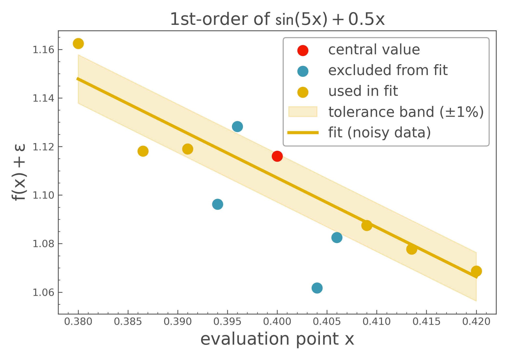

# derivkit

**DerivKit** is a robust Python toolkit for stable numerical derivatives, built for scientific computing, cosmology, and any domain requiring accurate gradients or higher-order expansions.

It provides:
- **Adaptive polynomial fitting** that excludes noisy points based on residuals,
- **High-order finite differences** for accurate stencil-based derivatives,
- A simple API for comparing both approaches side by side.

Whether you're analyzing clean analytic functions or noisy simulations, `derivkit` is designed to stay accurate and resilient.

---

## Adaptive Fit Example

Below is a visual example of the **adaptive method** estimating the first derivative of a nonlinear function in the presence of noise. The method selectively discards outlier points before fitting a polynomial, resulting in a robust and smooth estimate.



---

## Installation

```bash
pip install derivkit

```

---


## Quick Start

```python
from derivkit import DerivativeKit

def simple_function(x):
    return x**2 + x

dk = DerivativeKit(function=simple_function, central_value=1.0, derivative_order=1)
print("Adaptive:", dk.adaptive.compute())
print("Finite Difference:", dk.finite.compute())
```

---
## Documentation

For detailed documentation, examples, and API reference, visit the [derivkit documentation](https://derivkit.readthedocs.io).

## Citation

If you use `derivkit` in your research, please cite it as follows:

```bibtex
@software{sarcevic2025derivkit,
  author       = {Nikolina Šarčević and Matthijs van der Wild},
  title        = {derivkit: A Python Toolkit for Numerical Derivatives},
  year         = {2025},
  publisher    = {GitHub},
  journal      = {GitHub Repository},
  howpublished = {\url{https://github.com/nikosarcevic/derivkit}},
  note         = {If you use this software, please cite this entry.}
}

```

## License
MIT License © 2025 Niko Šarčević, Matthijs van der Wild
